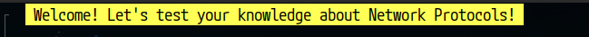
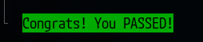
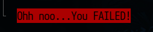
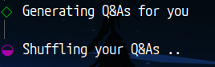
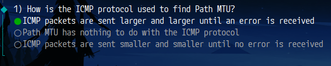
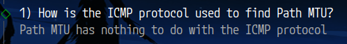
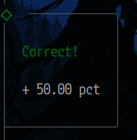

# Network Protocols `TUI` Quiz

> 👨‍💻 A `CLI TUI` tool written in `JavaScript` with `NodeJS`,
> leveraging the power of [`@clack/prompts`](https://github.com/bombshell-dev/clack.git)
> to deliver an interactive quiz experience right in your terminal.

## Preview/Results


`@clack/prompts` elements:


## About the Quiz

Welcome to the **Network Protocols `TUI` Quiz** -
a fun and engaging way to challenge your understanding of essential networking concepts!
This quiz is designed for everyone,
whether you’re a novice eager to learn or a seasoned professional wanting to brush up on your knowledge.

### How It Works
- **Customizable Questions**: Choose how many questions you want to answer, from a minimum of 1 to a maximum of 43.
- **Randomized Order**: Each quiz session will feature a shuffled order of questions, and the multiple-choice answers will also be presented in random order. This adds an extra layer of challenge and keeps the quiz fresh!
- **Instant Feedback**: After each question, receive immediate feedback:
  - **Correct Answers**: If you answer correctly, you’ll see "Correct!" in green, along with a score that reflects your performance based on the total questions selected.
  - **Incorrect Answers**: If your answer is wrong, "Incorrect!" will be displayed in red, accompanied by a helpful explanation of the correct answer.
- **Final Score Assessment**: At the end of the quiz, your total score will be shown. A score above 5 will be presented in green, while lower scores will appear in red, giving you a clear indication of your performance.

Dive in and see how well you know your network protocols!

## Running the `TUI` Tool

Setting up a project with `npm` can often be a nightmare for most of us,
especially when it involves wrestling with configuration files and `NodeJS` dependencies.

To simplify the process, I’ve created a 🐳 `Docker image` that automates everything for you.

Just run the [`run.sh`](run.sh) script in your terminal:
```bash
$ source run.sh
# or
$ chmod +x run.sh
$ ./run.sh
```

This script generates a `Docker image` based on the [`Dockerfile`](Dockerfile) from the working directory.
It launches the **CLI TUI** quiz within a `Docker container` that has all dependencies pre-installed.
Once you complete the quiz, the `Docker container` is automatically removed.

> NOTE:
> If you need to exit the quiz prematurely by pressing `CTRL-C`, remember to remove the `Docker image` manually.


## Running the Tool Anywhere

You can easily run the quiz from any directory by following these steps:

```bash
$ docker pull bgd24/network-protocols-interactive-tui-quiz

# Append the alias to your shell configuration file (~/.bashrc, ~/.zshrc, ~/.profile)
$ echo 'alias TUI_quiz="docker run --rm -it bgd24/network-protocols-interactive-tui-quiz"' >> ~/.bashrc
$ source ~/.bashrc

$ type TUI_quiz
alias TUI_quiz="docker run --rm -it bgd24/network-protocols-interactive-tui-quiz"

# Now you can run TUI_quiz from any directory
$ TUI_quiz
```


## `Clack` API
---


```js
import { intro, isCancel, cancel, note, outro, select, spinner, text } from '@clack/prompts';
```


### `Clack` API | Intro
---


Code:
```js
intro(`${color.bgYellowBright(color.black(" Welcome! Let's test your knowledge about Network Protocols! "))}`);
```

Result:



### `Clack` API | Outro
---

Code:
```js
if (grade < 5) {
  outro(`${color.bgRed(color.black(`${final_message}`))}`);
} else {
  outro(`${color.bgGreen(color.black(`${final_message}`))}`);
}
```

Result:





### `Clack` API | Spinner
---


Also use the `time` to keep the **spinners** running.


Code:
```js
import { setTimeout as sleep } from 'node:timers/promises';

const oneSecondOfSleep = 1000;

const spin = spinner();

// First spinner
spin.start('Generating Q&As for you ');
await sleep(3 * oneSecondOfSleep);
spin.stop('Generating Q&As for you');

// Second spinner
spin.start('Shuffling your Q&As ');
await sleep(3 * oneSecondOfSleep);
spin.stop('Shuffling your Q&As');
```

Result:




### `Clack` API | Select (choose one value from a list)
---


Code:
```js
const userAnswear = await select({
    message: `${statistics.question_idx}) ${question.questionText}`,
    options: shuffledAnswears.map(answer => ({ value: answer }))
});
```

Result:





### `Clack` API | Note
---


Code:
```js
note(`${color.red('Incorrect!')}\n\nFEEDBACK:\n${question.feedback}`);
```

Result:




### `Clack` API | isCancel
---


Code:
```js
if (isCancel(....)) {
  cancel('Process was interrupted!');
  process.exit(0);
}
```

Result:

